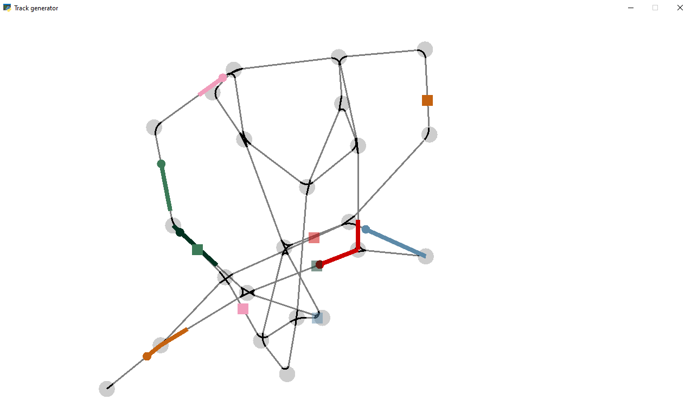

# Using MARL to perform Vehicle Re-scheduling

This project attempts to use Multi-agent Reinforcement Learning in order to solve

## Part 1: Train simulation



We built a python simulation that allows you to create an arbitrary rail-network in the form of a graph. If you don't 
have a pre-determined rail-network, we also provide a rail-network generator, which allows you to generate an arbitrary 
graph that realistically represents a rail-network. On top of this graph, you can place trains, set up the intended
destination, control the trains through an agent or through a deterministic policy. You can view these trains in action through a arcade-powered
visualization, or simply run the simulation offline to save resources.

To see a demo simulation in action, simply run the file `main_track_generator.py` by running the following command

```bash
python3 ./main_track_generator.py
```

Video demo: https://www.youtube.com/watch?v=MzE3NwjuZRk

## Part 2: Training an RL agent

We also provide a Dueling Double DQN model to allows you to train a neural network to control the behavior of the
trains to optimize the amount of time it takes for trains to reach their destination. The neural network adapted to
potential breakdowns of the trains in mind. For a detailed paper that describes the method, you can view the paper PDF
[here](./paper/paper.pdf). To train a multi-agent neural network, please run the following command:

```bash
python3 ./main_multi_agent_training.py
```

A `checkpoints` folder will be created that saves the model for every 50 episodes of training. To load a specific model
and test run the performance, go to following lines within `main_model_deployment.py`

```python
def main():
    """ Main function """
    np.random.seed(801)
    game = TrainSimulation(
        SCREEN_WIDTH, SCREEN_HEIGHT, SCREEN_TITLE,
        average_track_length=350, num_transitions=14, num_trains=6,
        model_file="sample_models/model_at_step_0")
    game.setup()
    arcade.run()
```

Change the `model_file` to the address of the model that you want to load, and then run the file by the following bash
command

```bash
python3 ./main_model_deployment.py
```

Two sample models are provided to you from scratch under the following path:

* `sample_models/model_at_step_0`
* `sample_models/model_at_step_450`
